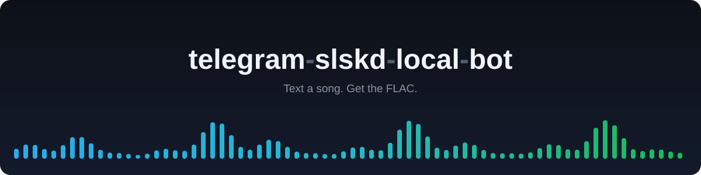
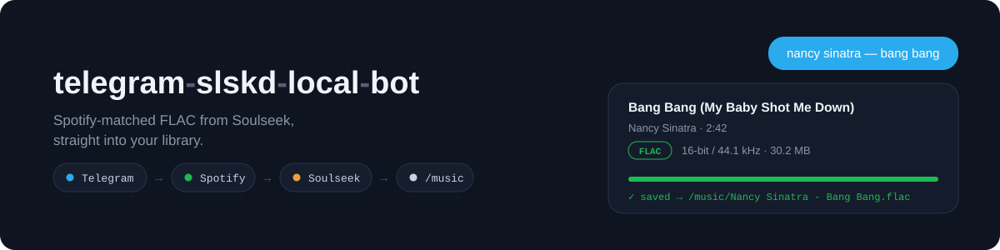
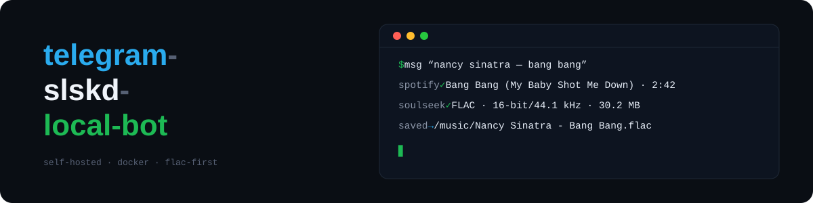
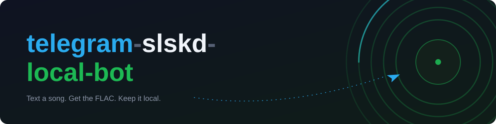

# README banner proposals

Four candidates to replace the current banner. Each is a self-contained SVG (no external fonts or images), paints its own background so it works on light and dark GitHub themes, and scales to full README width.

## A — Waveform

Minimal identity: the wordmark over an equalizer wave that runs Telegram blue → FLAC green.

## B — Chat

Product story: the pipeline pills (Telegram → Spotify → Soulseek → /music) plus a request bubble in and a FLAC result card out.

## C — Terminal

Self-hosted vibe: stacked wordmark beside a terminal session replaying one download. The cursor blinks when rendered on GitHub.

## D — Poster

Bold type with a vinyl motif; the paper plane flies the request into the record.
