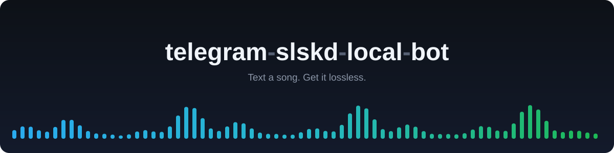

---
hide:
  - navigation
---

# telegram-slskd-local-bot { .tsb-visually-hidden }

  

  
  
  
  

---

**telegram-slskd-local-bot** is a Telegram bot, run in Docker next to your [slskd](https://github.com/slskd/slskd), that turns a song name typed on your phone into a lossless file in your music library. It looks the song up on Spotify, searches Soulseek, ranks the lossless copies by duration, bit depth and source with any lossy copies listed below them, and sends you the file in the chat so you can listen to it and read its lossless check before it is saved as `Artist - Title` in its own format. Doing the same by hand in the slskd web UI means reading file lists, guessing which copy is the studio version and finding out after the fact that the FLAC was an MP3. Start with [Getting started](getting-started.md), then [Usage](usage.md).

-   :material-docker: **[Getting started](getting-started.md)**

    ---

    Fetch the compose file, fill in the three tokens and the two folders, start the container. Also from PyPI.

-   :material-message-text-outline: **[Usage](usage.md)**

    ---

    What the chat shows from the first message to the saved file, the commands, and how the copies are ranked.

-   :material-tune: **[Configuration](configuration.md)**

    ---

    Every environment variable, its default, and which ones the compose file needs on the host side.

-   :material-sitemap-outline: **[How it works](how-it-works.md)**

    ---

    Resolve on Spotify, search and score on slskd, listen and approve in the chat, save and sweep.

## What the chat looks like

You text the bot a song name. When Spotify returns more than one distinct track it shows them as buttons; you pick one. It searches Soulseek through your slskd, ranks the copies with every lossless one before every lossy one, and shows the best ones with format, duration, bit depth and sample rate or bitrate, and size. You tap one, or Auto-pick best. The download shows its progress, then the file itself arrives in the chat, as it is when it is under Telegram's 50 MB limit (2000 MB with a local Bot API server) and an Opus copy of the whole song when it is over, with a verdict line: `Lossless OK`, or `Possible transcode`, `Likely transcode` or `Fake lossless` with the frequency where the spectrum stops. You tap Save to library or Reject. [Usage](usage.md) walks through it step by step.

## What it does

- Resolves artist, title, album and duration on Spotify, and warns when similar files are already in your library before it searches.
- Lists every lossless copy of known length before every lossy one, so a song with no lossless copy still gets a lossy one. Within each group it ranks by duration against Spotify, bit depth and sample rate (hi-res first) or bitrate, the uploader's free slot, speed and queue, and the file name; drops live, remix and karaoke cuts unless the title has them.
- Checks the spectrum of a lossless file (FLAC, WAV or AIFF) and flags an MP3-style cutoff before you save. A copy clearly made from a lossy file never reaches the library: the bot deletes it and tries the next copy.
- Saves as `Artist - Title` with its own extension (`.flac`, `.wav`, `.mp3`...) and the Spotify cover art embedded, in the folder your player or [audio-transcode-watcher](https://github.com/GeiserX/audio-transcode-watcher) watches.
- `/import` a Spotify playlist or album and review each track or auto-save them all; `/auto` per chat saves the best match without a tap; a failed transfer gets Retry and Try next result.
- Chat delivery (`/deliver`, or `TELEGRAM_CHAT_DELIVERY_USERS`) sends the track into the chat under 50 MB and saves nothing anywhere, and ranks copies by quality for their size.
- `/format` per chat sends tracks as the original, MP3 320 kbps or Opus 192 kbps.
- **Whole album from this source** under a saved or sent track fetches the folder it came from on that peer: every file saved to the library with the album cover, skipping files you already have, or sent into the chat (see [Album delivery](usage.md#album-delivery)).
- Sends originals up to 2000 MB instead of 50 MB through a [local Bot API server](getting-started.md#send-files-over-50-mb-a-local-bot-api-server), started with the compose profile `bigfiles`.
- A wishlist: when nothing is found, or nothing good enough, the bot searches again every `WISHLIST_CHECK_HOURS` and tells you, or fetches the copy with `/auto` on, when one turns up (`/wishlist`).
- A [library sweep](sweep.md), off by default: once a week it looks for a better copy of every song in the library, replaces the ones it is sure about, and sends you both files of the rest to judge by ear (Keep mine, Take new, Keep both).
- An [MCP server](mcp.md) over the same pipeline, so an agent like Claude Code can resolve, search, download and wishlist tracks, over stdio or over HTTP from the bot process with a bearer token.
- Cancels in slskd every transfer it gives up on, and sweeps leftover downloads after `ORPHAN_SWEEP_HOURS` (6) without touching a transfer in flight.

## How it runs

- One container, `drumsergio/telegram-slskd-local-bot`, pinned to a release tag, amd64 only, running as user id 1000 with a read-only root filesystem. It needs a running [slskd](https://github.com/slskd/slskd) with an API key, a Spotify Developer app and a Telegram bot token.
- Three folders: slskd's completed downloads, your music library, and a data folder for the SQLite history and import state. All three must be writable by uid 1000. See [Configuration](configuration.md).
- Without Docker, `pip install 'telegram-slskd-local-bot[analysis]'` plus `ffmpeg` runs the same bot as `slskd-importer run`. See [Getting started](getting-started.md#from-pypi).

## What it does not do

- It does not run a Soulseek client. slskd does; the bot talks to slskd's API.
- It does not download anything without a tap unless you turn `/auto` on for that chat or pick Auto-save all for an import.
- It does not check `/import` tracks for a lossy cutoff, and in auto-mode it saves the best copy whatever the check says.
- It does not build for arm64.

## Privacy

- The bot answers only the Telegram user ids in `TELEGRAM_ALLOWED_USERS`, and answers nobody while the list is empty; the denial reply shows the sender their own id.
- Spotify is used for metadata only, through the Client Credentials flow: no Spotify login, no listening data.
- Nothing leaves your host but the searches sent to your slskd, the metadata requests to Spotify and the messages to Telegram.

## Getting help

- Something broken: read [Troubleshooting](troubleshooting.md), then open an [issue](https://github.com/GeiserX/telegram-slskd-local-bot/issues) with the details it lists.
- A security problem: follow the [security policy](https://github.com/GeiserX/telegram-slskd-local-bot/blob/main/SECURITY.md), never a public issue.
- What changed between releases: the [changelog on GitHub](https://github.com/GeiserX/telegram-slskd-local-bot/blob/main/docs/CHANGELOG.md).
- Building, testing and releasing it: [Development](development.md). The rest of the music pipeline and the other Telegram bots: [Related projects](related.md).

## License

telegram-slskd-local-bot is released under the [GPL-3.0-or-later](https://github.com/GeiserX/telegram-slskd-local-bot/blob/main/LICENSE) license.
